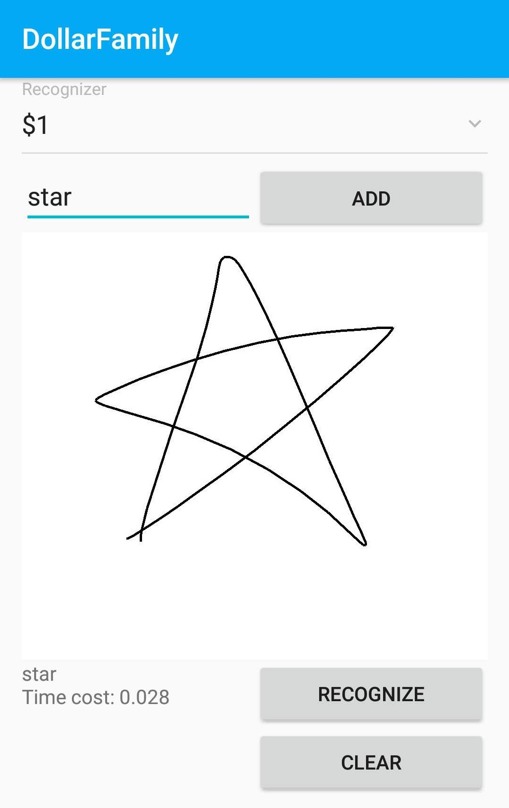

# Android implement $-Family

$-Family website: http://depts.washington.edu/madlab/proj/dollar/index.html

The website provides C#, Javascript implementation.

Here is the Android Java version.

# UI

